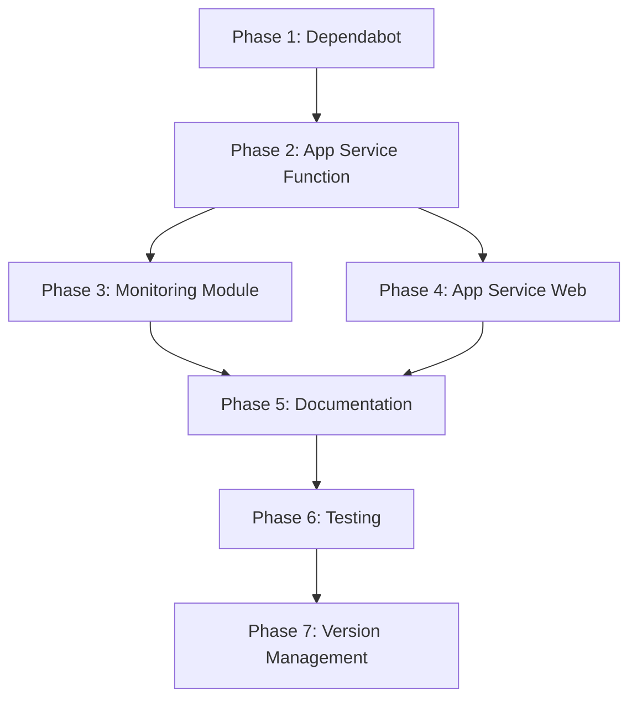

# Implementation Plan: Module Refactoring & Dependabot Integration

## Project Goal
Refactor existing Terraform Azure modules to use the centralized `storage-account` module and configure Dependabot for automatic dependency updates.

## Phase 1: Dependabot Configuration ✅ COMPLETED

### 1.1 Update Dependabot Configuration ✅
- **File:** `.github/dependabot.yml`
- **Action:** Added storage-account module to weekly scanning
- **Status:** Completed

### 1.2 Create Documentation ✅
- **File:** `docs/DEPENDABOT_SETUP.md`
- **Action:** Comprehensive guide for private registry setup
- **Status:** Completed

### 1.3 Configure Secrets ⏳ MANUAL STEP
- **Location:** GitHub Repository Settings → Secrets and variables → Dependabot
- **Action:** Add `TF_API_TOKEN` secret
- **Status:** Requires manual intervention

## Phase 2: App Service Function Module Refactoring 🔄 IN PROGRESS

### 2.1 Update Core Module Files

#### 2.1.1 Variables Configuration ✅ COMPLETED
- **File:** `modules/app-service-function/variables.tf`
- **Changes Made:**
  - Added `location_short` variable (required by storage-account module)
  - Added storage account configuration variables:
    - `storage_account_tier`
    - `storage_account_replication_type`
    - `enable_storage_versioning`
    - `enable_storage_change_feed`
    - `storage_delete_retention_days`

#### 2.1.2 Main Configuration ⏳ IN PROGRESS
- **File:** `modules/app-service-function/main.tf`
- **Required Changes:**
  ```hcl
  # Replace this:
  resource "azurerm_storage_account" "functions" {
    # ... direct resource configuration
  }
  
  # With this:
  module "functions_storage" {
    source = "../storage-account"
    # ... module configuration
  }
  ```
- **Update Function App references:**
  ```hcl
  # Change from:
  storage_account_name       = azurerm_storage_account.functions.name
  storage_account_access_key = azurerm_storage_account.functions.primary_access_key
  
  # To:
  storage_account_name       = module.functions_storage.storage_account_name
  storage_account_access_key = module.functions_storage.primary_access_key
  ```

#### 2.1.3 Outputs Configuration ⏳ PENDING
- **File:** `modules/app-service-function/outputs.tf`
- **Required Changes:**
  - Update storage account outputs to reference module outputs
  - Ensure backward compatibility for existing consumers

### 2.2 Update Examples

#### 2.2.1 Basic Example ⏳ PENDING
- **File:** `modules/app-service-function/examples/basic/main.tf`
- **Required Changes:**
  - Add `location_short` variable
  - Add basic storage configuration variables

#### 2.2.2 Complete Example ⏳ PENDING
- **File:** `modules/app-service-function/examples/complete/main.tf`
- **Required Changes:**
  - Add all new storage configuration variables
  - Show advanced storage features

### 2.3 Function App Special Requirements ⏳ PENDING
- **Validation:** Ensure Function Apps work with module-created storage
- **Requirements:**
  - `shared_access_key_enabled = true`
  - `public_network_access_enabled = true`
- **Testing:** Verify Function App can access storage account

## Phase 3: Monitoring Module Refactoring ⏳ PENDING

### 3.1 Update Core Module Files
- **File:** `modules/monitoring/main.tf`
- **Current State:** Has optional storage account resource
- **Required Changes:**
  - Replace `azurerm_storage_account.monitoring` with module call
  - Maintain conditional creation pattern (`count = var.enable_storage_monitoring ? 1 : 0`)

### 3.2 Update Variables and Outputs
- **Files:** `modules/monitoring/variables.tf`, `modules/monitoring/outputs.tf`
- **Required Changes:**
  - Add storage account configuration variables
  - Update outputs to reference module outputs conditionally

### 3.3 Update Examples
- **Files:** Basic and complete examples
- **Required Changes:**
  - Update examples to use new storage configuration

## Phase 4: App Service Web Module Enhancement ⏳ PENDING

### 4.1 Add Optional Storage Support
- **File:** `modules/app-service-web/main.tf`
- **Current State:** No storage account
- **Required Changes:**
  - Add optional storage account module call
  - Use for static content hosting, backups, or file uploads

### 4.2 Update Variables and Outputs
- **Files:** `modules/app-service-web/variables.tf`, `modules/app-service-web/outputs.tf`
- **Required Changes:**
  - Add optional storage configuration variables
  - Add storage account outputs when enabled

### 4.3 Create Examples
- **Basic Example:** Without storage account
- **Complete Example:** With storage account for static content

## Phase 5: Documentation Updates ⏳ PENDING

### 5.1 Module Documentation
- **Files:** Each module's `README.md`
- **Required Changes:**
  - Document storage-account module dependency
  - Update usage examples
  - Add migration guide for existing users

### 5.2 Main Repository Documentation
- **File:** `README.md`
- **Required Changes:**
  - Add module relationship diagram
  - Document inter-module dependencies
  - Update quick start examples

## Phase 6: Testing & Validation ⏳ PENDING

### 6.1 Terraform Validation
- **Action:** Run validation for all modules
- **Commands:**
  ```bash
  cd modules/app-service-function && terraform init && terraform validate
  cd modules/monitoring && terraform init && terraform validate
  cd modules/app-service-web && terraform init && terraform validate
  cd modules/storage-account && terraform init && terraform validate
  ```

### 6.2 Example Testing
- **Action:** Test all examples work correctly
- **Validation:** Ensure examples can be deployed successfully

### 6.3 CI/CD Pipeline Updates
- **File:** `.github/workflows/terraform.yml`
- **Required Changes:** Ensure workflows handle module dependencies correctly

## Phase 7: Version Management ⏳ PENDING

### 7.1 Semantic Versioning
- **Current Version:** v1.1.21
- **Planned Version:** v1.2.0 (minor version bump for new features)
- **Breaking Changes:** Document any backward compatibility issues

### 7.2 Terraform Cloud Publishing
- **Action:** Test module publishing with dependencies
- **Validation:** Ensure modules can be consumed from Terraform Cloud registry

## Implementation Order & Dependencies



## Risk Mitigation

### Backward Compatibility
- **Risk:** Breaking existing deployments
- **Mitigation:** 
  - Provide migration guide
  - Consider feature flags for gradual adoption
  - Test with existing configurations

### Module Dependencies
- **Risk:** Circular dependencies or missing outputs
- **Mitigation:**
  - Careful output mapping
  - Test module integration thoroughly
  - Document all required outputs

### Function App Requirements
- **Risk:** Function Apps may not work with module-created storage
- **Mitigation:**
  - Validate all Function App requirements are met
  - Test in development environment first
  - Maintain Function App-specific configurations

## Success Criteria

1. ✅ All modules use storage-account module instead of direct resources
2. ✅ Dependabot automatically updates provider versions
3. ✅ All examples work correctly
4. ✅ Terraform validation passes for all modules
5. ✅ Documentation is updated and comprehensive
6. ✅ CI/CD pipelines continue to work
7. ✅ Modules can be published to Terraform Cloud successfully
